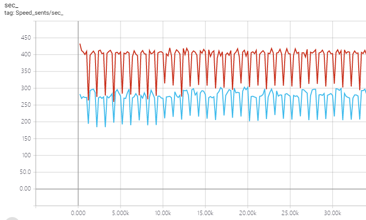
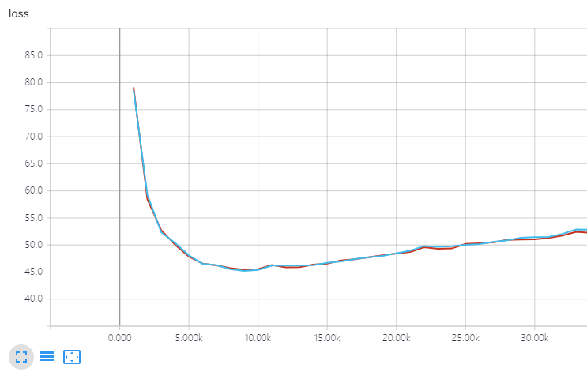

# Distributed Training

**Note:** We do not test our codes on the multi-node multi-GPU training.

- [Distributed Training](#distributed-training)
  - [Prerequisite](#prerequisite)
  - [Usage](#usage)
  - [Performance](#performance)
  - [Q&A](#qa)
    - [Why we don't use `DistributedDataParallel`](#why-we-dont-use-distributeddataparallel)
    - [Why we don't use `Horovod`](#why-we-dont-use-horovod)

## Prerequisite

Need to install NCCL. You can download and install it from the [official website of NVIDIA](https://developer.nvidia.com/nccl).

## Usage

We use a `launch` script to launch distributed training. As an example, if we want to training on a server with four GPUs. We can modify training script as below:

``` bash
python -m src.distributed.launch \
    --nproc_per_node=4 \
    --nnodes=1 --node_rank=0 \
    --master_addr="127.0.0.1" --master_port=1234 \
    src.bin.train \
    --model_name <your-model-name> \
    --reload \
    --config_path <your-config-path> \
    --log_path <your-log-path> \
    --saveto <path-to-save-checkpoints> \
    --valid_path <path-to-save-validation-translation> \
    --use_gpu \
    --shared_dir "/tmp"
```
`nnodes` means there is only one node (server). `nproc_per_node` means there are four processes -- for GPUs on this node, as we spawn one process for each GPU. `node_rank` it is the No.0 (numbers start from 0) node in the whole distributed training. `master_addr` and `master_port` mean the ip address and port number of the master node. We set `master_addr` as localhost since there is only on server. `shared_dir` is a directory shard by all the nodes in order to send and receive some large data between processes. In particular,

    1. Save the shared data into temporary files under the shared directory.
    2. Send the directories of these temporary files instead.
    3. Read and merge these files and store the shared data.

We can lauch distributed decoding in the same way as training.

## Performance

Here we show comparison on IWSLT15 English-Vietnamese dataset. We set the true batch size as 4096. On TITAN-X, we compare the speed and loss on validation data between training on single card and two cards. The configuration of single card training is `batch_size=1024,update_cycle=4`, while of two cards training it is `batch_size=1024, update_cycle=2`. We show the speed and loss curve Tensorboard below (the blue one is single card and the red is two-cards-training):

Speed



Loss



## Q&A

### Why we don't use `DistributedDataParallel`

`DistributedDataParallel`(DDP) use backward hook to implement the gradient communication between processes. In particular, every time backward is completed on a process, DDP invokes allreduce operation. This is a common trick to reduce overhead by overlapping computation and communication. However, we cannot use `update_cycle` with DDP, which is a method to cut large batch into several small batches, computing loss and accumulating gradientsa. Besides, I think it is not convenient to add DDP wrappers for all the modules in a model.

Therefore, by reference to Horovod, we put allreduce operations in optimizer, and invoke these operations manually before updating parameters with gradients. In this way we can run several steps of forward and backward, and use optimizer to update paramters with gradients at one time. In exchange, it will lose some speed in training.

### Why we don't use `Horovod`

Using Horovod requires to install OpenMPI. It is time-consuming to install, especially when you do not have sudo authority. Besides, Horovod is not support on windows. 


 